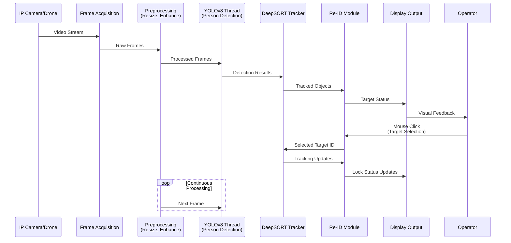

<div align="center">

# ArdDrone — Smart Target Tracking System

**v1.0.0** — *An advanced real-time tactical target tracking system for drone and IP camera applications*

[](https://python.org)
[](https://ultralytics.com/yolov8)
[](https://github.com/nwojke/deep_sort)
[](https://opencv.org)
[](LICENSE)

---

</div>

## Table of Contents
- [Overview](#overview)
- [System Architecture](#system-architecture)
- [Key Features](#key-features)
- [Installation](#installation)
- [Usage](#usage)
- [How It Works](#how-it-works)
- [Project Structure](#project-structure)
- [Performance](#performance)
- [Limitations](#limitations)
- [Future Improvements](#future-improvements)
- [License](#license)

## Overview

ArdDrone is an advanced real-time tactical target tracking system designed for persistent human target acquisition using live IP camera, RTSP, or drone video streams. The system combines state-of-the-art computer vision techniques to provide reliable target locking and re-identification capabilities.

The system implements a sophisticated tracking pipeline that enables:
- Reliable click-to-lock targeting
- Stable target persistence after disappearance
- Re-identification after target re-entry
- Tactical single-target visualization mode
- Background multi-person analysis without visual clutter

## System Architecture

```mermaid
graph TD
    A[IP Camera/Drone Feed] --> B[Frame Acquisition]
    B --> C{Preprocessing}
    C --> D[YOLOv8 Human Detection]
    D --> E[DeepSORT Multi-Object Tracking]
    E --> F[Target Selection<br/>(Mouse Click)]
    F --> G[HSV Appearance<br/>Embedding]
    G --> H[Target Re-Identification<br/>Module]
    H --> I[Persistent Tactical<br/>Target Lock]
    I --> J[Display Output]
    J --> K[User Interface<br/>with FPS Counter]
    
    subgraph Re-ID Module
        H --> L[Appearance Memory<br/>Management]
        H --> M[Similarity<br/>Thresholding]
        H --> N[Face Detection<br/>Bonus (V9)]
    end
    
    style A fill:#f9f,stroke:#333
    style I fill:#ff9,stroke:#333
    style J fill:#9f9,stroke:#333
```

## Key Features

### Core Capabilities
- **Real-time Human Detection**: Utilizes YOLOv8n for fast and accurate person detection
- **Multi-Object Tracking**: Employs DeepSORT algorithm for robust tracking with unique ID assignment
- **Persistent Target Lock**: Maintains lock on selected target even when temporarily obscured
- **Appearance-Based Re-Identification**: Uses HSV histogram comparison for target recovery
- **Low-Latency Processing**: Optimized pipeline with threaded YOLO inference and buffer management
- **Tactical Visualization**: Clean interface showing only locked target or search status

### Advanced Features (V9 - update.py)
- **Automatic Stream Reconnection**: Recovers from network interruptions without manual restart
- **Face Detection Bonus**: Enhances re-identification accuracy using Haar cascades
- **Adaptive Memory System**: Maintains rolling buffer of target appearances for improved recognition
- **Image Enhancement**: Applies CLAHE for better performance in varying lighting conditions
- **FPS & Memory Monitoring**: Real-time performance metrics displayed in UI

### User Interaction
- **Click-to-Lock**: Simple mouse click interface for target selection
- **Visual Feedback**: Clear color coding (green=tracking, red=locked, searching text)
- **ID Display**: Shows track IDs for all visible targets
- **Exit Control**: Escape key for clean shutdown

## Installation

### Prerequisites
- Python 3.9 or higher
- IP Camera / RTSP Stream / Drone Camera source
- Compatible OS: macOS / Linux / Windows

### Step-by-Step Setup

1. **Clone the repository**:
   ```bash
   git clone <repository-url>
   cd ard_drone
   ```

2. **Create and activate virtual environment** (recommended):
   ```bash
   python3 -m venv venv
   source venv/bin/activate  # On Windows: venv\Scripts\activate
   ```

3. **Install dependencies**:
   ```bash
   pip install -r requirements.txt
   ```
   
   *Alternatively, the update.py script includes auto-installation:*
   ```bash
   python src/update.py
   ```

4. **Required Python packages**:
   - `ultralytics` (YOLOv8 implementation)
   - `deep_sort_realtime` 
   - `opencv-python`
   - `numpy`

## Usage

### Basic Tracking (tracker.py)
```bash
cd src
python tracker.py
```

### Enhanced Tracking V9 (update.py)
```bash
cd src
python update.py
```

### Operation Workflow
1. Upon startup, the system connects to your IP camera stream
2. All detected persons appear with green bounding boxes and ID labels
3. Click on any person with your mouse to select them as the target
4. The system enters tactical tracking mode:
   - All green boxes disappear
   - Only the selected target remains visible with a red bounding box
   - "TARGET LOCK" label appears above the target
5. If the target leaves the frame:
   - Display shows "SEARCHING TARGET..." message
   - System continues background re-identification attempts
6. When target reappears:
   - Automatic re-identification occurs if appearance matches
   - Tactical lock is restored with red box and label
7. Press ESC to exit the application

## How It Works

### Tracking Pipeline



### Re-Identification Process

```mermaid
graph LR
    A[Target Selected] --> B[Extract HSV Embedding]
    B --> C[Store in Memory Buffer]
    C --> D[Continuous Comparison<br/>with New Detections]
    D --> E{Similarity > Threshold?}
    E -->|Yes| F[Target Re-Identified]
    E -->|No| G[Continue Searching]
    F --> H[Update Memory Buffer]
    H --> C
    G --> C
    
    subgraph Memory Management
        C --> I[Adaptive Memory<br/>(Max 40 entries)]
        I --> J[FIFO Buffer Management]
    end
```

## Project Structure

```
ard_drone/
├── src/
│   ├── tracker.py          # Basic tracking implementation
│   └── update.py           # Enhanced V9 implementation with auto-reconnect
├── docs/                   # Documentation files
├── tests/                  # Test suites (to be implemented)
├── assets/                 # Media files, configs, etc.
├── README.md              # This file
├── readme.md              # Legacy installation instructions
└── .git/                  # Git repository data
```

## Performance

### Typical Performance Metrics
- **Apple Silicon Systems**:
  - 416 × 320 resolution: ~25-30 FPS
  - 640 × 480 resolution: ~15-20 FPS

### Factors Affecting Performance
1. **Network Stability**: IP stream consistency directly impacts tracking quality
2. **Camera Stream Quality**: Resolution, compression, and lighting conditions
3. **Hardware Acceleration**: GPU availability (Apple Silicon MPS, CUDA)
4. **Scene Complexity**: Number of visible persons affects processing time
5. **Processing Pipeline**: Threaded design helps maintain responsiveness

### Optimizations Implemented
- Reduced frame resolution for faster processing
- Threaded YOLO inference to prevent blocking
- Camera buffer minimization for lower latency
- Lightweight YOLOv8n model selection
- OpenCV optimization flags
- Efficient histogram comparison algorithms

## Limitations

### Current Constraints
1. **Appearance-Based ReID Only**: 
   - Relies solely on HSV histogram comparison
   - Similar clothing may reduce accuracy
   - Severe lighting changes can affect re-identification

2. **Tracking Challenges**:
   - Heavy occlusion may temporarily break tracking
   - Fast camera motion may reduce stability
   - Very fast-moving targets may exceed tracking capabilities

3. **System Dependencies**:
   - Requires stable IP camera connection
   - Performance varies significantly with hardware
   - Initial model download required for YOLOv8

### Known Issues
- No GPU fallback mechanism if MPS/CUDA unavailable
- Limited to person class detection (COCO class 0)
- Memory buffer may not capture drastic appearance changes
- No confidence scoring for re-identification decisions

## Future Improvements

### Planned Enhancements
1. **Advanced Re-Identification Models**:
   - Integration of OSNet or FastReID for better accuracy
   - Deep learning-based appearance features
   - Multi-modal fusion (appearance + motion)

2. **System Robustness**:
   - Improved autonomous drone following capabilities
   - PTZ camera integration for active tracking
   - Multi-camera tracking handoff systems
   - Edge AI deployment optimization

3. **Performance Upgrades**:
   - CUDA acceleration support for NVIDIA GPUs
   - Kalman filter trajectory prediction
   - Real-time telemetry overlay systems
   - Target priority classification algorithms

4. **User Experience**:
   - Enhanced GUI with configuration options
   - Recording and playback functionality
   - Remote control via web interface
   - Comprehensive logging and analytics

## License

This project is licensed under the MIT License - see the [LICENSE](LICENSE) file for details.

## Acknowledgments

- YOLOv8 by Ultralytics for real-time object detection
- DeepSORT implementation by nxwojke for multi-object tracking
- OpenCV community for computer vision tools and algorithms
- Project Silent Reaper and Skynet-Biogenics initiative for foundational work

---
*Last updated: May 2026*
